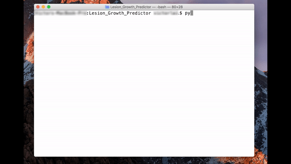

# Synopsis

*Lesion Growth Predictor* is a [course](https://sa.ucla.edu/ro/Public/SOC/Results/ClassDetail?term_cd=17S&subj_area_cd=COM%20SCI&crs_catlg_no=0188%20%20%20%20&class_id=187827210&class_no=%20002%20%20)
project in development which predicts lesion growth for patients with stroke.
Read about our findings [here](https://sites.google.com/g.ucla.edu/predicting-lesion-growth).



# Data
Please contact [Fabien Scalzo](http://web.cs.ucla.edu/~fab/) to access the data
used for this project. Specifically ask for the matrices.

The dataset used in this project (not included in this repository) contains 
data associated with perfusion imaging of the brains of anonymous stroke 
patients admitted to the University of California, Los Angeles medical center.
The data was pre-processed (via image segmentation, registration, etc.) by 
Scalzo's lab team.

# Development
Functionality has been implemented to load the data from the dataset (not
included). Tools to visualize the data have also been created to look for any
funny values or outliers, examine a range of values more closely, and figure
out which features seem important. In addition, methods to help tune
hyperparameters and record results have been fully implemented.

Incremental/online machine learning algorithms are being explored to see how 
well it performs in predicting perfusion parameters of interest. In particular,
stochastic gradient descent and the Passive-Aggressive algorithms will be 
evaluated.

# Installation
Download or clone this repository. 

Make sure Python **2.x** is installed on your machine. The following 
packages are used in the scripts.

* [numpy](http://www.numpy.org/)
* [matplotlib](https://matplotlib.org/)
* [scipy](https://www.scipy.org/)
* [scikit-learn](http://scikit-learn.org/stable/)
* [pandas](http://pandas.pydata.org/)
# [plotly](https://plot.ly/)

# Usage
Note that there is no dataset published to this repository, so make sure a 
data set is included as a subdirectory in this repository before running this 
project. The base class *DataSet* can also be implemented in **_data.py_** to 
provide an interface to extract the data from the dataset of your choice. If 
the dataset being used belongs to Scalzo, make sure that the path to the
datasets indicated in **_data.py_** is modified accordingly. The included
packages in **_data.py_** should also be verified. The main script may also
need to be modified accordingly.

Then, open up a terminal (or command line), change directories to this 
repository directory, and enter the following to run the script to evaluate 
the machine learning techniques.

```
$ python main.py
```

If you are utilizing the dataset from Scalzo's team, then that's it! Just
follow the instructions from the command prompt. It's user-friendly!
